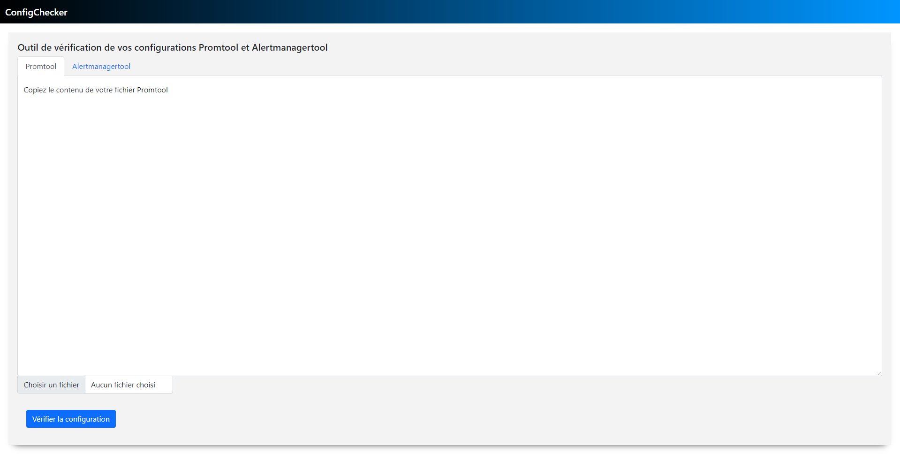
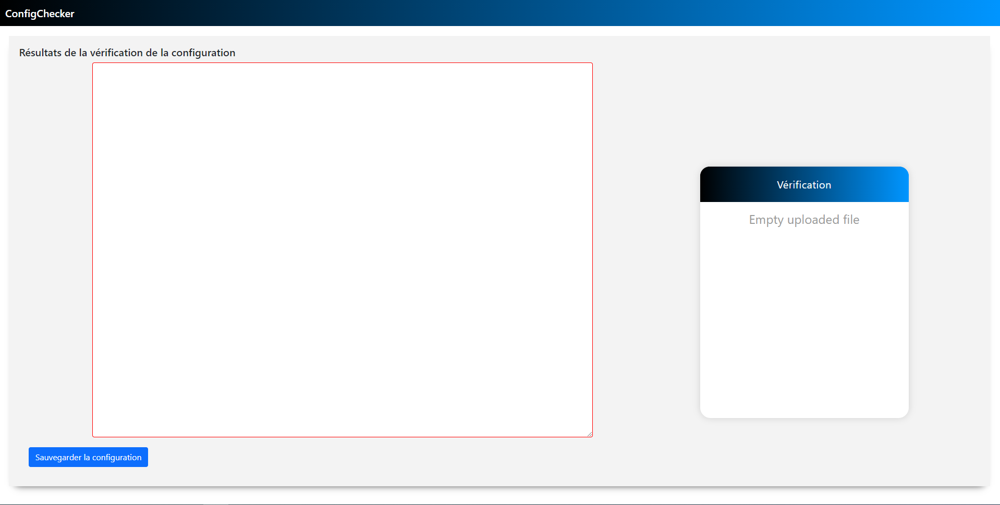

# ConfigChecker

[](https://shields.io/)
[](https://github.com/gomods/athens)
[](https://opensource.org/licenses/Apache-2.0)

## What is it ?

This tool offers to prometheus and altermanager users the possibility to verify their configuration files.
Indeed this web application permits to (upload/write) your configuration into the app, then to verify its syntax. It's helpful before a deployement of new configurations, or to modify former ones.

## First steps

### Run

In order to use this application, you'll have to build the application using the *Makefile*.
First, you can use :

```bash 
make all 
```

This command will install go dependancies, test the app on your system and then run your application on the port (8181) on localhost.

### Build 

You're also able to build an executable version of the app by using :
```bash
make build
```

Then you will find the exe called *configChecker* in the *bin/* directory, and use it as it is.

### Clean

You can clean the project directory by using :
```bash
make clean
```

This will delete your *bin/* directory, and thus delete the executable file.

## How to use

## Verify your configuration

To use the checker, you must copy paste or upload your *yml* file in the corresponding area.
Also you have to pay attention to activate tab. There is to tabs, one permits you to check promtool files, and the second alertmanagertool ones. Therefore a baid choice can lead to a bad result.
Once your file got upload, you will see its content in the area.



Then you can click on the button on the bottom of the page.

## Observe the results


This will lead to the results page. You can see the errors of your configuration on the right of the screen, and to correct them.
After its correction, you will can copypaste the textarea content in your configuration file or to download it with the name *config.yml*
